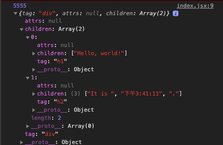

## rick-react

> 一个极简的 React 框架，用于实践 React 实现原理，请不要用于生产环境

> 计划实现了 JSX，组件，生命周期，diff，setState，react hook 等核心功能

```
git clone https://github.com/Chant-Lee/rick-react.git
cd rick-react
npm install
npm start
```

### 使用插件介绍

#### 安装 [babel](https://www.babeljs.cn/setup#installation)

```
npm install --save-dev @babel/core @babel/cli
```

#### 创建.babelrc 配置文件,启用一些[插件](https://www.babeljs.cn/docs/plugins)。

```
npm install @babel/preset-env --save-dev

```

##### .babelrc

```
{
  "presets": ["@babel/preset-env"]
}
```

#### 安装 [@babel/plugin-transform-react-jsx](https://www.babeljs.cn/docs/babel-plugin-transform-react-jsx)

##### 没有选项配置

```
{
  "plugins": ["@babel/plugin-transform-react-jsx"]
}
```

##### 带选项配置

```
{
  "plugins": [
    ["@babel/plugin-transform-react-jsx", {
      "pragma": "Preact.h", // default pragma is React.createElement
      "pragmaFrag": "Preact.Fragment", // default is React.Fragment
      "throwIfNamespace": false // defaults to true
    }]
  ]
}
```

- pragma: string - 替换编译 JSX 表达式时使用的函数。默认为 React.createElement。
- pragmaFrag: string - 替换编译 JSX 片段时使用的组件。默认为 React.Fragment。
- useBuiltIns: boolean - 默认为 false
- [更多设置](https://babeljs.io/docs/en/plugins#plugin-options)

#### [Parcel](https://zh.parceljs.org/getting_started.html) 是 Web 应用打包工具

```
npm install -g parcel-bundler
```

### 方法介绍

#### 第一个小目标实现 [React.createElement](https://github.com/facebook/react/blob/master/packages/react/src/ReactElement.js)

`@babel/plugin-transform-react-jsx` 插件会将 `jsx` 代码转译成用 `React.createElement` 方法包裹的代码。
我们可以参考 react [官方 api](https://reactjs.org/docs/react-api.html#createelement),整体看还是很简单.

创建并返回指定类型的新 [React 元素](https://zh-hans.reactjs.org/docs/rendering-elements.html)。其中的类型参数既可以是标签名字符串（如 'div' 或 'span'），也可以是 React 组件 类型 （class 组件或函数组件），或是 React fragment 类型。

```
//https://reactjs.org/docs/react-api.html#createelement

function createElement( type, props, ...children ) {
    return {
        tag,
        props,
        children
    }
}
```

#### 将上面定义的 `createElement` 方法放到对象 React 中

```
const element = (
    <div>
        hello<span>world!</span>
    </div>
);
```

我们可以看到运用 babel 会编译成如下

```
var element = /*#__PURE__*/React.createElement("div", null, "hello", /*#__PURE__*/React.createElement("span", null, "world!"));

```

当我们实现 createElement 打印出什么呢？请继续往下看

```
const React = {
    createElement
}

const element = (
    <div>
        hello<span>world!</span>
    </div>
);
console.log( element );

```


上述图片记录信息的对象我们就称之为`虚拟 DOM`,JSON 格式如下

```
{
    "tag":"div",
    "attrs":null,
    "children":[
        {
            "tag":"h1",
            "attrs":null,
            "children":[
                "Hello, world!"
            ]
        },
        {
            "tag":"h2",
            "attrs":null,
            "children":[
                "欢迎使用 React."
            ]
        }
    ]
}
```

#### 第二个小目标 [ReactDOM.render](https://github.com/facebook/react/blob/master/packages/react-dom/src/client/ReactDOMLegacy.js) - **将虚拟 DOM 渲染成真实的 DOM**

```
ReactDOM.render(
    <h1>Hello, world!</h1>,
    document.getElementById('root')
);
```

经过 babel 转换成如下

```
ReactDOM.render(
    React.createElement( 'h1', null, 'Hello, world!' ),
    document.getElementById('root')
);
```

ReactDOM.render 简单实现

```
function render( vnode, container, callback=null ) {

    // 当vnode为字符串时，渲染结果是一段文本
    if ( typeof vnode === 'string' ) {
        const textNode = document.createTextNode( vnode );
        return container.appendChild( textNode );
    }

    const dom = document.createElement( vnode.tag );

    if ( vnode.attrs ) {
        Object.keys( vnode.attrs ).forEach( key => {
             // 当属性名为className时，改回class
            if ( key === 'className' ) key = 'class';
            dom.setAttribute( key, vnode.attrs[ key ] )
        } );
    }

    vnode.children.forEach( child => render( child, dom ) );    // 递归渲染子节点

    return container.appendChild( dom );    // 将渲染结果挂载到真正的DOM上
}

```

这里注意 React 为了避免类名 class 和 js 关键字 class 冲突，将类名改成了 className，在渲染成真实 DOM 时，需要将其改回。
